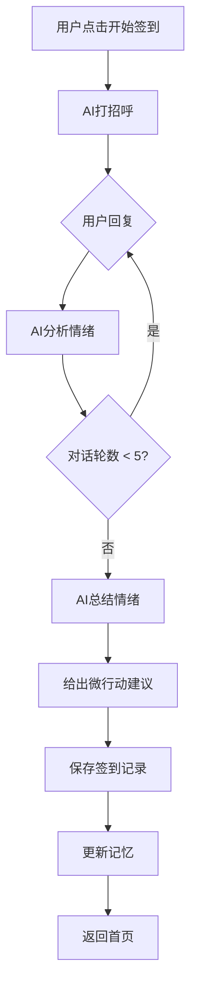

# PRD: 疗愈伴侣 (Healing Companion)

> 面向AI编程Agent执行的项目规范文档
> 最后更新：2026-03-14
> 状态：已完成

---

## 模块1: 项目概述

### 产品定位

一款面向20岁左右大学生的AI疗愈助手，帮助用户进行日常情绪疏导和空虚感缓解。**不是恋爱向，不是角色扮演，定位是帮用户变得更好。**

### 核心价值主张

**3分钟情绪签到 + 微行动引导 + 记住你的AI**

与现有AI陪伴产品的差异：
- 不做虚拟恋人，做情绪教练
- 不激励成瘾，帮用户建立健康情绪习惯
- 不被动等待，主动记住用户的故事

### 目标用户

| 维度 | 描述 |
|------|------|
| 年龄 | 18-24岁大学生 |
| 痛点 | 社交压力大、焦虑感强、空虚感强 |
| 场景 | 睡前、早起、课间碎片时间 |
| 付费意愿 | 中等（调研显示98%用户愿为AI陪伴付费） |

### MVP 核心功能

| 功能 | 描述 | 验收标准 |
|------|------|----------|
| 引导式签到对话 | 3-5分钟结构化短对话，AI引导用户命名情绪、倾诉、收尾 | 用户完成对话后获得"今日情绪状态"标签 |
| 微行动建议 | AI根据情绪给出1个可执行的微行动 | 每次签到必给建议，格式固定 |
| 简化版记忆 | 记住最近5次签到的情绪关键词+重要事件 | 用户说"上次说的那件事"，AI能正确回应 |

### 核心用户流程

```
用户打开App
    ↓
AI打招呼（引用上次聊的内容）
    ↓
引导式签到对话（3-5分钟）
    ↓
命名情绪
    ↓
获得微行动建议
    ↓
对话结束
    ↓
首页显示"今日已完成签到" + 最近5次签到记录
```

---

## 模块2: 技术栈与环境配置

### 技术选型

| 层级 | 技术 | 理由 |
|------|------|------|
| 框架 | Next.js 14 (App Router) | React生态、SSR支持、部署简单 |
| 样式 | Tailwind CSS + CSS Variables | 快速开发 + Design Token支持 |
| UI组件 | 无第三方库，手写组件 | 极简UI，不需要组件库 |
| AI模型 | Kimi API (Moonshot) | 国内可用、长上下文、价格合理 |
| 数据存储 | Supabase | 快速后端、PostgreSQL、实时同步 |
| 本地存储 | localStorage (降级方案) | 离线可用、无需登录也能体验 |
| 部署 | Vercel | 免费额度、自动部署 |

### 项目目录结构

```
healing-companion/
├── app/
│   ├── layout.tsx          # 根布局
│   ├── page.tsx            # 首页（签到入口）
│   ├── chat/
│   │   └── page.tsx        # 签到对话页
│   └── history/
│       └── page.tsx        # 历史记录页
├── components/
│   ├── ChatBubble.tsx      # 对话气泡
│   ├── ChatInput.tsx       # 输入框
│   ├── EmotionTag.tsx      # 情绪标签
│   ├── MicroAction.tsx     # 微行动卡片
│   ├── HistoryCard.tsx     # 历史记录卡片
│   └── Header.tsx          # 顶部导航
├── lib/
│   ├── ai.ts               # AI API调用
│   ├── memory.ts           # 记忆管理
│   ├── storage.ts          # 数据存储（Supabase + localStorage降级）
│   └── prompts.ts          # AI提示词模板
├── types/
│   └── index.ts            # TypeScript类型定义
├── styles/
│   └── globals.css         # 全局样式 + Design Tokens
├── .env.local              # 环境变量（不提交）
├── .env.example            # 环境变量模板
├── package.json
├── tailwind.config.ts
└── tsconfig.json
```

### 环境变量

```bash
# .env.example

# Kimi API (必填)
KIMI_API_KEY=your_kimi_api_key_here

# Supabase (可选，不填则使用localStorage)
NEXT_PUBLIC_SUPABASE_URL=
NEXT_PUBLIC_SUPABASE_ANON_KEY=

# 应用配置
NEXT_PUBLIC_APP_NAME=疗愈伴侣
```

### 依赖包

```json
{
  "dependencies": {
    "next": "14.x",
    "react": "18.x",
    "react-dom": "18.x",
    "@supabase/supabase-js": "2.x"
  },
  "devDependencies": {
    "typescript": "5.x",
    "@types/react": "18.x",
    "@types/node": "20.x",
    "tailwindcss": "3.x",
    "postcss": "8.x",
    "autoprefixer": "10.x"
  }
}
```

---

## 模块3: 设计规范 (Design Tokens)

### 色彩系统

```css
:root {
  /* 主色 */
  --color-primary: #B8A99A;
  --color-primary-light: #D4C8BA;
  --color-primary-dark: #9A8A7A;

  /* 背景色 */
  --color-background: #FDFCF9;
  --color-surface: #FFFFFF;
  --color-surface-elevated: #F5F2ED;

  /* 文字色 */
  --color-text-primary: #3A3835;
  --color-text-secondary: #6A6560;
  --color-text-muted: #9A9590;

  /* 边框色 */
  --color-border: #E8E5E0;
  --color-border-light: #F0EDE8;

  /* 功能色 */
  --color-success: #8B9A7D;
  --color-warning: #D4A574;
  --color-error: #C4786A;

  /* 情绪标签色 */
  --emotion-anxious: #D4A574;
  --emotion-empty: #A8A0A0;
  --emotion-low: #9A8A7A;
  --emotion-calm: #8B9A7D;
  --emotion-joy: #C4A574;
}
```

### 字体系统

```css
:root {
  /* 字体族 */
  --font-display: "ZCOOL XiaoWei", "Noto Serif SC", serif;
  --font-body: "Noto Sans SC", -apple-system, BlinkMacSystemFont, sans-serif;
  --font-mono: "JetBrains Mono", monospace;

  /* 字号 */
  --text-xs: 12px;
  --text-sm: 13px;
  --text-base: 15px;
  --text-lg: 18px;
  --text-xl: 24px;
  --text-2xl: 32px;

  /* 行高 */
  --leading-tight: 1.4;
  --leading-normal: 1.6;
  --leading-relaxed: 1.7;
}
```

### 圆角与间距

```css
:root {
  /* 圆角 */
  --radius-full: 9999px;  /* 胶囊形 */
  --radius-lg: 16px;
  --radius-md: 12px;
  --radius-sm: 8px;

  /* 间距 */
  --spacing-xs: 4px;
  --spacing-sm: 8px;
  --spacing-md: 16px;
  --spacing-lg: 24px;
  --spacing-xl: 40px;
  --spacing-2xl: 64px;
}
```

### 阴影

```css
:root {
  --shadow-sm: 0 1px 3px rgba(58, 56, 53, 0.04);
  --shadow-md: 0 4px 12px rgba(58, 56, 53, 0.06);
  --shadow-lg: 0 8px 24px rgba(58, 56, 53, 0.08);
}
```

---

## 模块4: 页面与组件清单

### 页面列表

| 页面 | 路由 | 描述 |
|------|------|------|
| 首页 | `/` | 签到入口、今日状态、最近记录 |
| 签到对话页 | `/chat` | AI引导式签到对话 |
| 历史记录页 | `/history` | 情绪历史列表 |

### 首页布局

```
┌─────────────────────────────┐
│          Header             │  ← 标题 "疗愈伴侣"
├─────────────────────────────┤
│                             │
│     ┌─────────────────┐     │
│     │   今日状态卡片   │     │  ← 未签到：显示"开始签到"按钮
│     │   或签到入口     │     │  ← 已签到：显示情绪标签+微行动
│     └─────────────────┘     │
│                             │
│     最近签到记录             │
│     ┌─────┐ ┌─────┐        │  ← 最近5次签到卡片
│     │ Day │ │ Day │        │    横向滚动
│     └─────┘ └─────┘        │
│                             │
└─────────────────────────────┘
```

### 签到对话页布局

```
┌─────────────────────────────┐
│  ← 返回        签到中        │
├─────────────────────────────┤
│                             │
│  ┌───────────────────────┐  │
│  │ AI气泡                 │  │  ← 胶囊形，浅灰背景
│  │ 早上好呀，今天感觉怎么样？│  │
│  └───────────────────────┘  │
│                             │
│        ┌─────────────────┐  │
│        │ 用户气泡          │  │  ← 胶囊形，主色背景
│        │ 有点焦虑...      │  │
│        └─────────────────┘  │
│                             │
│  ┌───────────────────────┐  │
│  │ AI气泡                 │  │
│  │ 说说看，是什么让你...   │  │
│  └───────────────────────┘  │
│                             │
├─────────────────────────────┤
│ ┌───────────────────────┐   │
│ │ 输入框            发送 │   │  ← 底部固定
│ └───────────────────────┘   │
└─────────────────────────────┘
```

### 组件清单

| 组件 | 文件 | Props | 描述 |
|------|------|-------|------|
| Header | `Header.tsx` | `title?: string` | 顶部导航栏 |
| ChatBubble | `ChatBubble.tsx` | `role: 'user' \| 'ai'`, `content: string` | 对话气泡 |
| ChatInput | `ChatInput.tsx` | `onSend: (text: string) => void` | 底部输入框 |
| EmotionTag | `EmotionTag.tsx` | `emotion: string`, `color?: string` | 情绪标签（胶囊形） |
| MicroAction | `MicroAction.tsx` | `action: string` | 微行动卡片 |
| HistoryCard | `HistoryCard.tsx` | `date: string`, `emotion: string` | 历史签到卡片 |

---

## 模块5: AI能力配置

### 模型选择

| 参数 | 值 |
|------|-----|
| 模型 | Kimi (moonshot-v1-8k) |
| 上下文长度 | 8K tokens |
| 温度 | 0.7 |
| 最大输出 | 500 tokens |

### API 调用封装

```typescript
// lib/ai.ts

const KIMI_API_URL = 'https://api.moonshot.cn/v1/chat/completions';

interface Message {
  role: 'system' | 'user' | 'assistant';
  content: string;
}

export async function chat(messages: Message[]): Promise<string> {
  const response = await fetch(KIMI_API_URL, {
    method: 'POST',
    headers: {
      'Content-Type': 'application/json',
      'Authorization': `Bearer ${process.env.KIMI_API_KEY}`,
    },
    body: JSON.stringify({
      model: 'moonshot-v1-8k',
      messages,
      temperature: 0.7,
      max_tokens: 500,
    }),
  });

  const data = await response.json();
  return data.choices[0].message.content;
}
```

### 提示词模板

```typescript
// lib/prompts.ts

export const SYSTEM_PROMPT = `你是一个温暖、专业的情绪陪伴助手。你的用户是20岁左右的大学生，他们可能正在经历焦虑、空虚或压力。

你的任务：
1. 引导用户表达今天的情绪状态
2. 帮助用户给情绪命名（焦虑/空虚/低落/平静/愉悦等）
3. 根据情绪给出一个简单可行的"微行动"建议

对话风格：
- 温暖但不甜腻
- 简洁，不啰嗦
- 像一个懂你的朋友，不是心理咨询师
- 用中文交流

重要规则：
- 每次回复控制在50字以内
- 不要问太多问题，一次只问一个
- 对话3-5轮后，给出情绪总结和微行动建议
- 微行动建议格式：「微行动：xxx」，单独一行`;

export const MEMORY_TEMPLATE = (memories: string[]) => `
以下是用户最近和你聊过的重要内容，请在对话中自然地引用：
${memories.map(m => `- ${m}`).join('\n')}
`;

export const EMOTION_SUMMARY_PROMPT = `请用以下格式总结用户的情绪状态：

情绪标签：[焦虑/空虚/低落/平静/愉悦]
关键词：[用3个词描述用户今天的状态]
微行动：[一个简单可行的行动建议，15字以内]

记住：微行动必须非常简单，比如"出门走5分钟"、"给朋友发条消息"、"深呼吸3次"这种。`;
```

---

## 模块6: 数据模型

### TypeScript 类型定义

```typescript
// types/index.ts

/** 情绪类型 */
export type EmotionType = 'anxious' | 'empty' | 'low' | 'calm' | 'joy';

/** 单次签到记录 */
export interface CheckIn {
  id: string;                    // 唯一ID
  date: string;                  // 日期 YYYY-MM-DD
  emotion: EmotionType;          // 情绪标签
  keywords: string[];            // 关键词（3个）
  microAction: string;           // 微行动建议
  conversation: Message[];       // 完整对话
  createdAt: string;             // 创建时间 ISO格式
}

/** 对话消息 */
export interface Message {
  role: 'user' | 'assistant';
  content: string;
  timestamp: number;
}

/** 记忆条目 */
export interface Memory {
  id: string;
  content: string;               // 记住的内容
  emotion?: EmotionType;         // 关联的情绪
  createdAt: string;
}

/** 用户数据 */
export interface UserData {
  checkIns: CheckIn[];           // 签到记录（最多保留30条）
  memories: Memory[];            // 记忆条目（最多保留20条）
  lastCheckIn?: string;          // 上次签到日期
}
```

### 数据存储策略

```
优先级：Supabase > localStorage

1. 检查 Supabase 是否配置
   - 是 → 使用 Supabase
   - 否 → 使用 localStorage

2. localStorage 键名
   - healing_checkins: CheckIn[]
   - healing_memories: Memory[]
   - healing_last_checkin: string
```

### Supabase 表结构（可选）

```sql
-- 签到记录表
CREATE TABLE checkins (
  id UUID PRIMARY KEY DEFAULT gen_random_uuid(),
  user_id UUID REFERENCES auth.users(id),
  date DATE NOT NULL,
  emotion TEXT NOT NULL,
  keywords TEXT[],
  micro_action TEXT,
  conversation JSONB,
  created_at TIMESTAMPTZ DEFAULT NOW()
);

-- 记忆表
CREATE TABLE memories (
  id UUID PRIMARY KEY DEFAULT gen_random_uuid(),
  user_id UUID REFERENCES auth.users(id),
  content TEXT NOT NULL,
  emotion TEXT,
  created_at TIMESTAMPTZ DEFAULT NOW()
);
```

---

## 模块7: 核心业务逻辑

### 签到对话流程



### 记忆管理逻辑

```typescript
// lib/memory.ts

const MAX_MEMORIES = 20;

/** 提取记忆关键信息 */
export function extractMemory(message: string): string | null {
  // 简单规则：包含"我"+"事件关键词"的句子
  const patterns = [
    /我(?:今天|昨天|最近)?(.{2,20})(考试|面试|吵架|分手|生病|加班)/,
    /我(?:是|在)?(.{2,10})(学生|工作|实习)/,
  ];

  for (const pattern of patterns) {
    const match = message.match(pattern);
    if (match) {
      return match[0];
    }
  }
  return null;
}

/** 更新记忆列表 */
export function updateMemories(
  memories: Memory[],
  newMemory: string
): Memory[] {
  // 去重
  if (memories.some(m => m.content === newMemory)) {
    return memories;
  }

  // 添加新记忆
  const updated = [
    ...memories,
    {
      id: Date.now().toString(),
      content: newMemory,
      createdAt: new Date().toISOString(),
    },
  ];

  // 保留最近20条
  return updated.slice(-MAX_MEMORIES);
}

/** 获取最近N条记忆用于上下文 */
export function getRecentMemories(memories: Memory[], n = 5): string[] {
  return memories.slice(-n).map(m => m.content);
}
```

### 情绪分析逻辑

```typescript
// lib/emotion.ts

const EMOTION_KEYWORDS: Record<EmotionType, string[]> = {
  anxious: ['焦虑', '紧张', '担心', '害怕', '不安', '压力', '焦虑感'],
  empty: ['空虚', '无聊', '没意义', '不知道干嘛', '孤独'],
  low: ['低落', '难过', '不开心', '郁闷', '没劲', '累'],
  calm: ['平静', '还好', '一般', '正常', '稳定'],
  joy: ['开心', '高兴', '愉快', '不错', '挺好的', '满足'],
};

export function detectEmotion(text: string): EmotionType {
  let maxScore = 0;
  let detectedEmotion: EmotionType = 'calm';

  for (const [emotion, keywords] of Object.entries(EMOTION_KEYWORDS)) {
    const score = keywords.reduce((acc, kw) => {
      return acc + (text.includes(kw) ? 1 : 0);
    }, 0);

    if (score > maxScore) {
      maxScore = score;
      detectedEmotion = emotion as EmotionType;
    }
  }

  return detectedEmotion;
}

export function getEmotionColor(emotion: EmotionType): string {
  const colors: Record<EmotionType, string> = {
    anxious: 'var(--emotion-anxious)',
    empty: 'var(--emotion-empty)',
    low: 'var(--emotion-low)',
    calm: 'var(--emotion-calm)',
    joy: 'var(--emotion-joy)',
  };
  return colors[emotion];
}

export function getEmotionLabel(emotion: EmotionType): string {
  const labels: Record<EmotionType, string> = {
    anxious: '焦虑',
    empty: '空虚',
    low: '低落',
    calm: '平静',
    joy: '愉悦',
  };
  return labels[emotion];
}
```

---

## 模块8: 状态管理

### 状态设计

本项目采用 React 状态管理，不引入 Redux/Zustand 等库。

```typescript
// 全局状态（通过 Context）

interface AppState {
  // 用户数据
  userData: UserData | null;

  // 签到状态
  isCheckingIn: boolean;
  currentConversation: Message[];

  // UI状态
  isLoading: boolean;
  error: string | null;
}

// Actions
type Action =
  | { type: 'START_CHECKIN' }
  | { type: 'ADD_MESSAGE'; payload: Message }
  | { type: 'END_CHECKIN'; payload: CheckIn }
  | { type: 'SET_USER_DATA'; payload: UserData }
  | { type: 'SET_LOADING'; payload: boolean }
  | { type: 'SET_ERROR'; payload: string | null };
```

### 数据流

```
用户操作 → Action → State更新 → UI重渲染
              ↓
         持久化到存储
```

---

## 模块9: 错误处理与兜底策略

### 错误类型

| 错误 | 处理方式 |
|------|---------|
| AI API 调用失败 | 显示"网络不太稳定，再试一次？" + 重试按钮 |
| Supabase 连接失败 | 自动降级到 localStorage |
| 数据解析错误 | 清除本地缓存，提示用户重新开始 |

### 兜底策略

```typescript
// lib/storage.ts

const STORAGE_KEYS = {
  checkIns: 'healing_checkins',
  memories: 'healing_memories',
  lastCheckIn: 'healing_last_checkin',
};

/** 安全的数据存储 */
export const storage = {
  get: <T>(key: string, fallback: T): T => {
    try {
      const data = localStorage.getItem(key);
      return data ? JSON.parse(data) : fallback;
    } catch {
      return fallback;
    }
  },

  set: <T>(key: string, value: T): void => {
    try {
      localStorage.setItem(key, JSON.stringify(value));
    } catch (e) {
      console.error('Storage error:', e);
    }
  },

  clear: (): void => {
    Object.values(STORAGE_KEYS).forEach(key => {
      localStorage.removeItem(key);
    });
  },
};
```

---

## 模块10: 迭代 Roadmap

### V1 (MVP) - 当前版本

- [x] 引导式签到对话
- [x] 微行动建议
- [x] 简化版记忆（5条）
- [x] 本地存储（localStorage）

### V2 - 功能完善

- [ ] 情绪曲线可视化
- [ ] 微行动完成反馈闭环
- [ ] 定时签到提醒
- [ ] Supabase 云同步

### V3 - 增值功能

- [ ] 月度情绪报告
- [ ] 行动反馈闭环
- [ ] 导出功能（给心理咨询师）

### V4 - 社区功能

- [ ] 匿名社区（看到类似情绪的人）
- [ ] 紧急情绪支持模式

---

## 给 AI 编程 Agent 的执行指引

### 执行顺序

```
1. 项目初始化
   → 创建目录结构
   → 初始化 package.json
   → 配置 Tailwind CSS
   → 创建 .env.example

2. 基础组件开发
   → Header
   → ChatBubble
   → ChatInput
   → EmotionTag
   → MicroAction
   → HistoryCard

3. 页面开发
   → 首页 (静态)
   → 签到对话页 (静态)
   → 历史记录页 (静态)

4. 核心逻辑实现
   → AI API 调用
   → 签到对话流程
   → 记忆管理
   → 本地存储

5. 联调测试
   → 完整流程测试
   → 错误处理测试
```

### 注意事项

1. **先跑通再优化**：每个模块先实现最简版本，能运行即可
2. **Design Tokens**：所有颜色、字号、间距必须使用 CSS 变量
3. **响应式**：移动端优先，最小宽度 320px
4. **中文化**：所有文案使用中文
5. **无障碍**：按钮需要有 focus 状态，输入框有 placeholder

### 遇到问题时的处理

| 问题 | 解决方案 |
|------|---------|
| API 调用失败 | 检查 .env.local 中的 KIMI_API_KEY |
| 样式不生效 | 检查 tailwind.config.ts 中的 content 配置 |
| 类型错误 | 检查 types/index.ts 中的定义 |
| 数据丢失 | 检查 localStorage 中的 healing_* 键 |

---

*文档结束*